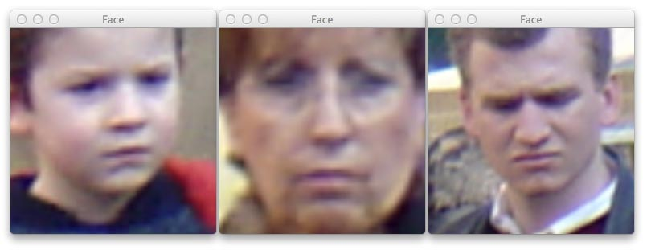
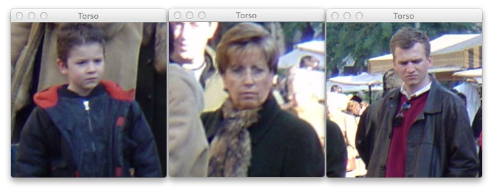
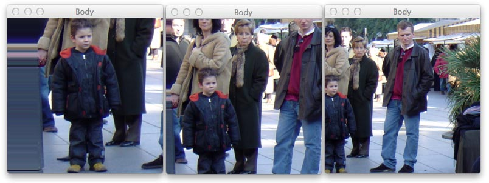
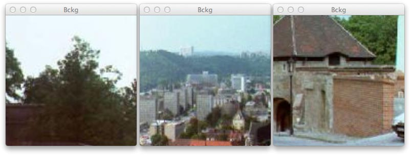
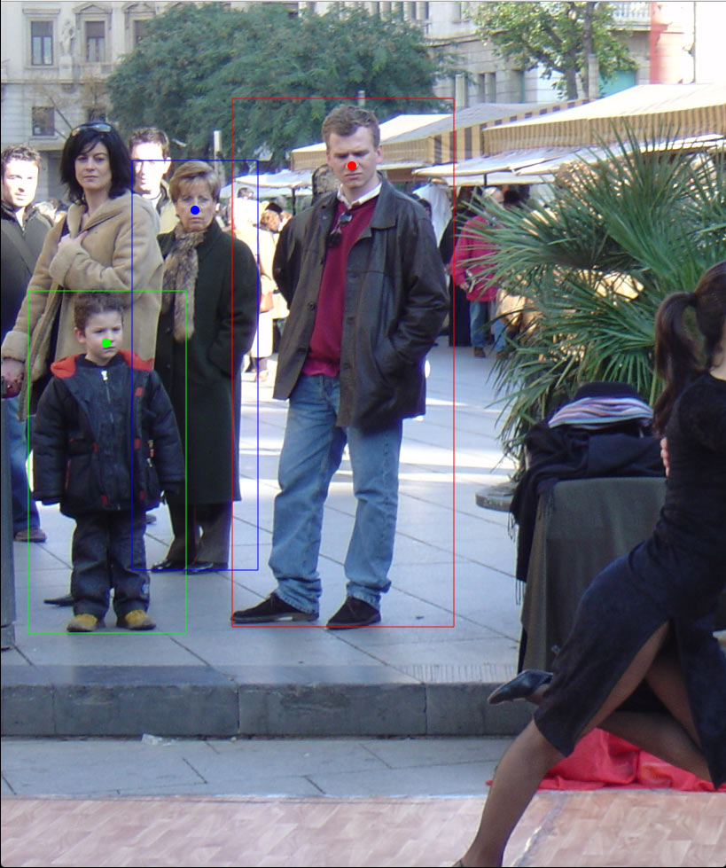

# torch-INRIA

[`makeClasses`](src/makeClasses.lua) is a simple script that loads face, torso, body and background samples from INRIA dataset and saves them in a *ImageNet* compatible format. This means, object are fairly centred and the sample size is 256 × 256 px².

In this first release, the dataset has to be downloaded manually from [here](http://pascal.inrialpes.fr/data/human/INRIAPerson.tar) and extracted into `~/Work/Datasets`.

> In the code there is my user name (`~` = `/Users/atcold`). I will probably update it in a following commit.

What this script does is simply extract every *face*, *torso* and *body* from the positive and *background* from the negative folder, cropping them square and saving them into a `Extracted-data` folder, under a sub-directory representing their label.

 - `Face`: are sized 1/3 of the width of the bounding box;
 - `Torso`: upper biggest square croppable from the bounding box;
 - `Body`: square with side equal to the hight of the bounding box. If the limits of the image are exceeded (the image is too narrow), the first/last column of pixel is replicated to fill the gap;
 - `Bckg`: squares of 128 px are cropped randomly from the negative samples.

And this is how they look like






## How to run it
After changing the folder pointers in the code (which I will make soon automatic), in the [`src`](src) directory, run

```
th makeClasses.lua
```

## How is this done?
To have an idea of the information provided with the dataset, I wrote [`checkBox`](src/checkBox.lua) which gives a general idea of what we can do with the data. To run it, go to the [`src`](src) directory and type

```
qlua checkBox.lua
```


